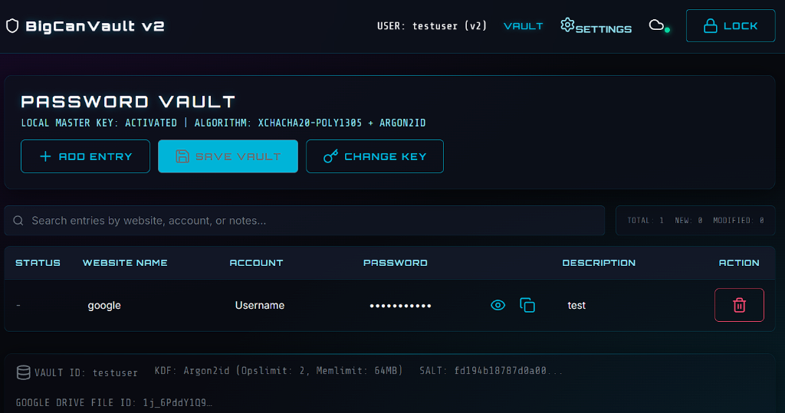
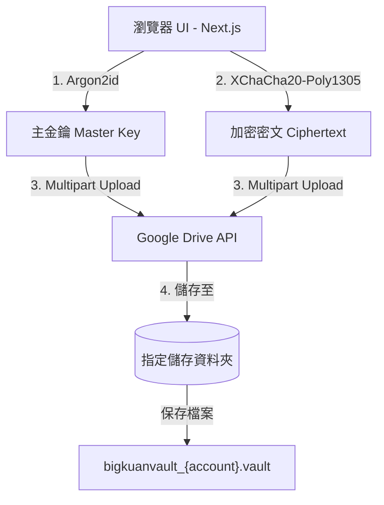

# BigCanVault v2 - Web Password Vault Manager (網頁版密碼管理器)




### 🔗 [Live Demo 立即體驗](https://bigcanvault-v2-git-main-eaglechen-9925s-projects.vercel.app/)

BigCanVault v2 是一個最先進的、零知識 (Zero-Knowledge) 的網頁密碼管理器。基於 **Next.js**、**TypeScript** 與 **libsodium-wrappers-sumo (WebAssembly)** 開發，並以使用者個人的 **Google Drive** 作為加密資料儲存空間。所有密鑰衍生、加解密流程皆在瀏覽器端 (Client-side) 完成，確保伺服器端（如 Vercel）絕不經手任何明文密碼或主金鑰。

本專案的前身為 Python / PySide6 的桌面版密碼管理器（現已移至 [desktop/](./desktop/) 目錄）。

---

## 系統架構 (Zero-Knowledge Architecture)



1. **瀏覽器端加密 (Client-Side Encryption)**：
   - 伺服器端只負責部署靜態網頁檔案，不處理明文資料、不儲存主密碼、不儲存主金鑰、不儲存 vault 檔案。
   - 所有敏感資料（明文記錄、主金鑰）僅儲存於瀏覽器記憶體中，關閉分頁或閒置鎖定後立即清空。

2. **金鑰衍生與加密演算法 (Cryptography)**：
   - **金鑰衍生 (KDF)**：使用 Argon2id 演算法 (`crypto_pwhash`)。隨機鹽值 (Salt) 為 16 bytes，操作限制 (Opslimit) 為 `2`，記憶體限制 (Memlimit) 為 `64MB`。為了在瀏覽器端能順利載入包含 `crypto_pwhash` 的 WebAssembly，本系統採用 `libsodium-wrappers-sumo` 依賴庫。
   - **對稱加密 (AEAD)**：使用 XChaCha20-Poly1305 演算法 (`crypto_aead_xchacha20poly1305_ietf_encrypt`)。每次存檔皆重新生成 24 bytes 的隨機隨機數 (Nonce)。
   - **帳號雜湊**：使用 SHA-256 對標準化的帳號進行雜湊處理，作為密碼庫的擁有者識別碼。

3. **Google Drive 儲存策略 (Google Drive API)**：
   - 使用 `drive.appdata` 權限範圍，僅能存取該帳號底下由本應用程式建立的隱藏資料空間（Application Data Folder），確保極致的資料隱私與安全性，且用戶在自己的 Google Drive 網頁介面上看不到此資料夾，防範誤刪。
   - 所有資料（新增、修改）皆直接讀寫同一個加密檔案：`bigkuanvault_{account}.vault`。不使用多個時間戳記版本備份或額外的指標檔案，確保結構簡潔高效。

---

## 主要功能 (Core Features)

- **主安全閘道 (Security Gateway)**：
  - **連接 Google Drive**：輸入自訂的 Google Client ID，以維持完全隱私。
  - **解密既有密碼庫**：輸入正確的帳號名稱與主密碼進行本地解密。
  - **初始化新密碼庫**：如果帳號尚未建立加密庫，可直接初始化全新空密碼庫。
  - **覆蓋驗證機制 (Overwrite Protection)**：在「新增密碼庫」時，若系統發現雲端已存在同名檔案，會強制要求進行解密驗證。只有提供正確的舊密碼並解密驗證成功後，系統才允許顯示確認覆蓋提示。若密碼不正確，則拒絕顯示覆蓋提示並丟出錯誤訊息，保障資料不被他人或自己因誤填而任意清除。

- **備份、災難復原與安全性 (Backup & Disaster Recovery)**：
  - **匯出加密備份 (Export Encrypted Backup)**：在「系統設定」中，可將目前記憶體中的密碼庫匯出下載至本地端。匯出的檔名依系統規範命名為 `bigkuanvault_{accountName}.vault`，且不會附加任何額外的時間戳記或多餘字元。
  - **上傳/匯入加密備份 (Upload/Import Encrypted Backup)**：
    - 使用者可直接上傳本地的 `.vault` 備份檔。
    - 上傳後，系統為保障安全性會強制將使用者登出，引導至解密登入介面。
    - 登入時，系統會先使用主密碼解密上傳的檔案內容，解密失敗即拋出錯誤。
    - 解密成功後，系統會比對帳號雜湊值（SHA-256 Owner Hash）是否與您輸入的帳號相符，不符即拋出錯誤。
    - 解密與帳號驗證皆通過後，系統會檢查備份檔名是否符合系統規範 `bigkuanvault_{accountName}.vault`。如果不相符（例如被使用者重新命名過），系統會**自動修改為標準檔名**，隨後將其載入至主畫面並同步上傳覆蓋至個人隱藏資料夾（Google Drive AppDataFolder）。
  - **安全刪除雲端加密檔 (Delete Vault from Google Drive)**：
    - 在「系統設定」中設有「Danger Zone」，提供刪除雲端密碼庫檔案的功能。
    - 為防止誤刪，此功能要求使用者必須**輸入主密碼進行二階段解密驗證**，驗證無誤並經過二次確認後，系統才會向 Google Drive 送出 `DELETE` 請求，並自動清除本地 Session 且登出。

- **舊版檔名自動相容與遷移 (Legacy Filename Migration)**：
  - 當使用者登入時，系統會自動在個人的 Google Drive 中同時查詢新版檔名 `bigkuanvault_{account}.vault` 與舊版檔名 `bigcanvault_{account}.vault`。
  - 如果只找到舊版檔名，系統會先對其進行解密，解密成功後**自動且無感地將雲端檔案重新命名（PATCH）為新版檔名**，完美相容舊版使用者的資料，不影響任何現有密碼庫的使用。

- **密碼庫主格 (Password Grid)**：
  - 支援網頁名稱、帳號、密碼 (預設遮罩)、與備註。
  - **自動清除剪貼簿**：複製密碼後，30 秒自動清空剪貼簿，保障安全。
  - **密碼產生器**：點擊按鈕即可隨機產生高強度的安全密碼。

- **行動裝置友善 (Mobile Friendly)**：
  - 偵測螢幕寬度，桌上型電腦顯示 TanStack 風格 Table，手機則轉換為 Card List 及編輯對話框。

- **系統設定 (System Settings)**：
  - 設定閒置自動鎖定時間 (Auto-Lock Timeout) 確保設備遺失時的安全性。
  - 隨時可以一鍵強制鎖定。

---

## 快速開始 (Quick Start)

### 1. 安裝與執行
在專案根目錄，執行以下指令以安裝依賴並開啟開發伺服器：

```bash
# 安裝依賴
npm install

# 執行開發伺服器
npm run dev
```

開啟瀏覽器並造訪 `http://localhost:3000`。

### 2. 生產環境建置
若要編譯並建立生產環境專用的 Next.js 網頁：

```bash
npm run build
npm run start
```

### 3. Google OAuth Client ID 設定與取得
本系統支援 **雙軌制 (Hybrid)** 設定 Google OAuth Client ID，您可以任選其一設定：
1. **本機瀏覽器設定 (用戶端優先)**：直接在登入介面的輸入框貼上您的 Client ID，系統會將其安全地保存在您瀏覽器的 `localStorage` 中。
2. **伺服器環境變數 (預設與部署用)**：在專案根目錄下建立 `.env` 檔案並填入環境變數，系統會自動讀取並預填：
   ```env
   NEXT_PUBLIC_GOOGLE_CLIENT_ID=您的帳號ID.apps.googleusercontent.com
   ```

**如何取得 Client ID：**
1. 造訪 [Google Cloud Console](https://console.cloud.google.com/)。
2. 建立新專案，前往「API 和服務」 &rarr; 「憑證」。
3. 點擊「建立憑證」 &rarr; 「OAuth 用戶端 ID」（應用程式類型選擇「網頁應用程式」）。
4. 在「已授權的 JavaScript 來源」加入 `http://localhost:3000`。
5. 前往「OAuth 同意畫面」，加入測試的使用者信箱，並在「網頁 API 開發」中啟用 **Google Drive API**。
6. 複製產生的「用戶端 ID (Client ID)」設定到上述任一設定項中。

---

## 目錄結構 (Directory Structure)

- `src/app/`：Next.js App Router 頁面。
  - `page.tsx`：解密/登入安全閘道頁。
  - `vault/page.tsx`：密碼庫主表格頁。
  - `settings/page.tsx`：系統設定與備份管理頁。
  - `layout.tsx` 與 `globals.css`：全域佈局與 cyberpunk 設計語彙 CSS。
- `src/components/`：全域 UI 組件（如 `Header` 導覽列）。
- `src/context/`：`VaultContext.tsx` 狀態管理（記憶體安全管理與自動鎖定邏輯）。
- `src/lib/`：邏輯封裝。
  - `crypto.ts`： Argon2id (`libsodium-wrappers-sumo`) 與 XChaCha20-Poly1305 WebAssembly 封裝。
  - `gdrive.ts`：Google Drive 檔案讀寫/版本控制 API REST 客戶端（鎖定至特定資料夾 `1cr021U7ziXOvacYn3GbN5_U9B3lta2Zu`）。
- `desktop/`：舊版 Python PySide6 密碼管理器桌面應用程式代碼與單元測試。
